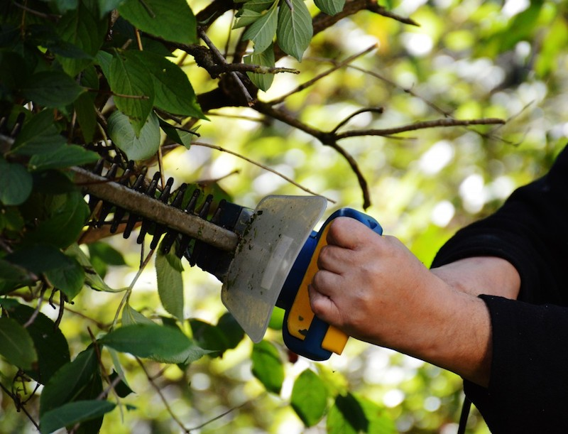

% Free Disk Space
% Tim Hopper
% 2018-08-30



__Use at your own risk.__

## Command Line

### Docker

```bash
docker system prune --all
# and
docker builder prune --all
```

### Conda

```bash
conda clean --all
```

### Git

#### Cleanup unnecessary files and optimize the local repository

```bash
git gc --aggressive --prune=now
```

### Deleted merged branches (except for `master`, `main`, `develop` or `dev`)

```bash
git branch --merged | egrep -v "(^\*|master|main|develop|dev)" | xargs git branch -d
```

### Homebrew

```bash
brew cleanup -s
```

### apt-get / aptitude

```bash
apt-get clean
# or
apt clean
# or
aptitude clean
```

### Mac/Linux Cache Folder

```bash
rm -r ~/.cache
```

### Yarn

```bash
yarn cache clean
```

## Utilities

* [CleanMyMac](https://macpaw.com/cleanmymac)
* [DaisyDisk](https://daisydiskapp.com)
* [Monolingual](https://ingmarstein.github.io/Monolingual/): "program for removing unnecessary language resources from macOS, in order to reclaim several hundred megabytes of disk space"

__Use at your own risk.__

([Pull request's welcome](https://github.com/tdhopper/freespace.tdhopper.com))
